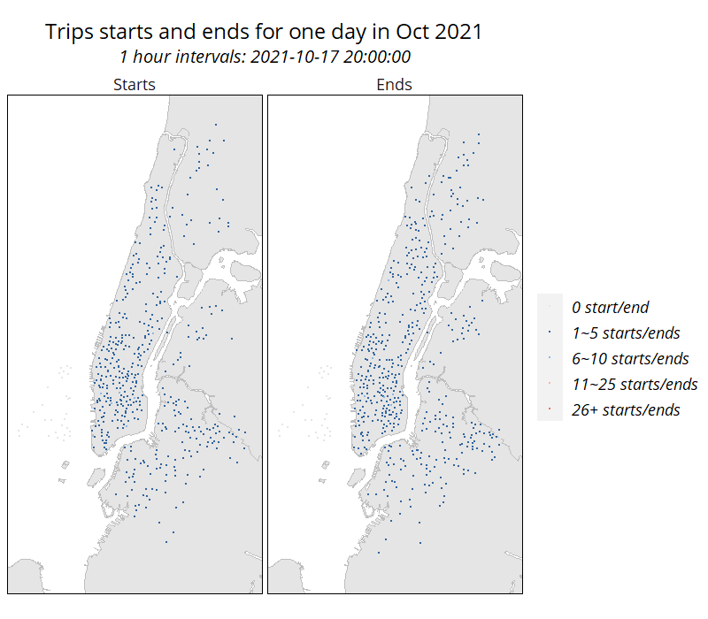
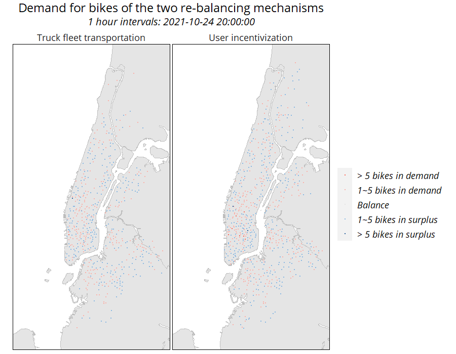

<style>
p.caption {
  font-size: 0.8em;
  text-align: center;
  font-weight: normal;
}
    caption {
      color: grey;
      font-size: 0.8em;
    } 
body{
  font-size: 11pt;
  font-family: Open Sans;
}
h1,h2,h3,h4,h5,h6{
  font-family: Open Sans;
}
td{
  font-size: 9pt;
  font-family: Open Sans;
}
th{
  font-size: 0.8em;
  font-family: Open Sans;
  color: grey;
}
</style>

```{r setup, include=FALSE}
knitr::opts_chunk$set(echo = TRUE)
```

```{r set_up, fig.keep='all', message=FALSE, warning=FALSE, results='hide'}
library(tidyverse)
library(sf)
library(lubridate)
library(tigris)
library(gganimate)
library(riem)
library(gridExtra)
library(knitr)
library(kableExtra)
library(FNN)
library(spdep)
library(caret)
library(ckanr)
library(grid)
library(gridExtra)
library(knitr)
library(kableExtra)
library(tidycensus)
library(scales)
library(stargazer)
library(sjPlot)
library(sjmisc)
library(sjlabelled)


setwd("C:/Users/leeje/OneDrive/G-1/CPLN-592/Codes/Assignment 5")
root.dir = "https://raw.githubusercontent.com/urbanSpatial/Public-Policy-Analytics-Landing/master/DATA/"
source("https://raw.githubusercontent.com/urbanSpatial/Public-Policy-Analytics-Landing/master/functions.r")

crs = 'EPSG:3435' # State Plain
# Define mapthemes
color1 = '#F3F3F3'
color2 = '#FC6D5C'
color3 = '#31649D'
color4 = '#F7B0A7'
color5 = '#9EBFE3'

windowsFonts(font = windowsFont('Open Sans'))
plotTheme2 <- function(base_size = 9, title_size = 10){
  theme(
    text = element_text(family = 'font', color = "black"),
    plot.title = element_text(family = 'font',
                              size = title_size, colour = "black", hjust = 0.5), 
    plot.subtitle = element_text(family = 'font', face = 'italic',
                                 size = base_size, colour = "black", hjust = 0.5),
    plot.caption = element_text(family = 'font', hjust=0),
    axis.ticks = element_blank(),
    panel.background = element_blank(),
    panel.grid.major = element_line("grey80", size = 0.01),
    panel.grid.minor = element_blank(),
    panel.border = element_rect(colour = "black", fill=NA, size=.5),
    strip.background = element_blank(),
    strip.text = element_text(family = 'font', size=9),
    axis.title = element_text(family = 'font', size=9),
    axis.text = element_text(family = 'font', size=7),
    axis.text.y = element_text(family = 'font', size=7),
    plot.background = element_blank(),
    legend.background = element_blank(),
    legend.title = element_text(family = 'font', colour = "black", face = "italic", size = 9),
    legend.text = element_text(family = 'font', colour = "black", face = "italic", size = 7),
    strip.text.x = element_text(family = 'font', size = 9),
    legend.key.size = unit(.5, 'line')
  )
}

```

## 1 Introduction

CitiBike is a dock-based bike-share system in New York. The successful operation of such a system relies not only on the density and ubiquitousness of stations, but also on the availability of bikes and opening docks in a station. A bike-share trip will not be possible, if there is no available bike at the origin or no opening dock at the destination. However, given the uneven distribution of the directions of bike-share trips at given times of the day, bikes and opening docks tend to be highly unbalanced in space.

To ensure better performance of the bike-share system, *re-balancing* is the practice of anticipating the demand for *bikes* and *docks* and manually redistribute bikes to ensure the availability of bikes and docks when needed.

In this project, I aim to develop an algorithm to predict the *trip starts* and *trip ends* across time and space. This could reveal potential bike-dock imbalances and inform the manual distribution of bikes. The re-balancing process consists of two mechanisms: 

1. Giving incentives for riders to ride from certain stations to others. This process is relatively slow and should be allowed ample amounts of time. Predictions will be made *two hours* ahead of time for the allocation of incentives.

2. Using a fleet of trucks to move bikes between nearby complimentary stations. Predictions will be made *one hour* ahead of time to allow for the transportation of bikes.

## 2 Data wrangling

### 2.1 Trip starts/ends aggregated by hour and station

The model will be built and tested on a CitiBike open data set that includes all valid trips ranging from October 1, 2021 to November 1, 2021. The *trip starts* and *trip ends* are aggregated by *hour* and *station*, which are the basic units for this model.

```{r data, eval = FALSE, fig.keep='all', message=FALSE, warning=FALSE, results='hide'}
# Read in bike-share data
citibikeRaw = read.csv('citibikeRaw.csv') 

# Convert time to whole hours
citibikeInterval = citibikeRaw %>%
  filter(., rideable_type == 'classic_bike') %>%
  mutate(startHour = ymd_h(substr(started_at, 1, 13)),
         endHour = ymd_h(substr(ended_at, 1, 13))) %>%
  dplyr::select(startHour, endHour,
                start_station_id, start_lat, start_lng,
                end_station_id, end_lat, end_lng)

# All the involved stations and their locations
stations = rbind(
  dplyr::select(citibikeInterval, 
                station = start_station_id, 
                lat = start_lat, 
                lng = start_lng),
  dplyr::select(citibikeInterval,
                station = end_station_id,
                lat = end_lat,
                lng = end_lng)
) %>%
  group_by(station) %>%
  summarize(lat = first(lat),
            lng = first(lng)) %>%
  filter(., station != '') %>%
  st_as_sf(coords = c('lng', 'lat'), crs = 4326, agr = 'constant') %>%
  st_transform(crs)

# All the hours
hours = rbind(
  dplyr::select(citibikeInterval,
                hour = startHour),
  dplyr::select(citibikeInterval,
                hour = endHour)
) %>%
  group_by(hour) %>%
  summarize(hour = first(hour)) %>%
  mutate(hour = as.POSIXct(hour)) %>%
  filter(., hour < as.Date('2021-11-01'))

# Permutate through all the hours and all the stations to get an empty working panel
panel = 
  expand.grid(hour = hours$hour,
              station = stations$station) %>%
  left_join(stations, by = 'station') %>%
  st_sf() %>%
  mutate(week = week(hour),
         dayOfWeek = wday(hour, label = T))

# Aggregate trip starts to station and hour

aggByStart = citibikeInterval %>%
  group_by(startHour, start_station_id) %>%
  summarize(count = n()) %>%
  rename(hour = startHour, station = start_station_id,
         starts = count) %>%
  filter(., station != '')

# Aggregate trip ends to station and hour

aggByEnd = citibikeInterval %>%
  group_by(endHour, end_station_id) %>%
  summarize(count = n()) %>%
  rename(hour = endHour, station = end_station_id,
         ends = count) %>%
  filter(., station != '')

# Join trip start/end counts to working panel

ridePanel = panel %>%
  left_join(aggByStart,
            by = c('hour' = 'hour',
                   'station' = 'station')) %>%
  left_join(aggByEnd,
            by = c('hour' = 'hour',
                   'station' = 'station')) %>%
  replace(is.na(.), 0)
```

### 2.2 Weather

Next, I add other predictors that may improved the model. It is reasonable to assume that weather has a great influence on riding behavior: people may be less incline to ride a bike when it rains or when it is too cold.

```{r weather, eval = FALSE, fig.keep='all', message=FALSE, warning=FALSE, results='hide', }

# Read in weather data
weather = riem_measures(
  station = 'NYC',
  date_start = '2021-10-01',
  date_end = '2021-11-01'
) %>%
  mutate_if(is.character, list(~replace(as.character(.), is.na(.), "0"))) %>% 
  replace(is.na(.), 0) %>%
  mutate(hour = ymd_h(substr(valid, 1, 13))) %>%
  mutate(week = week(hour),
         dayOfWeek = wday(hour, label = T)) %>%
  group_by(hour) %>%
  summarize(temp = max(tmpf),
            precip = sum(p01i),
            windSpeed = max(sknt)) %>%
  mutate(temp = ifelse(temp == 0, 42, temp)) %>%
  mutate(precip = ifelse(precip > 0.2, 'Rain/Snow', 'None')) # Mutate precipitation into two categories: precipitation and no precipitation

# Join weather data to panel

rideWeatherPanel = 
  ridePanel %>%
  left_join(weather, by = 'hour') %>%
  mutate(temp = ifelse(is.na(temp), mean(weather$temp), temp),
         precip = ifelse(is.na(precip), 'None', precip),
         windSpeed = ifelse(is.na(windSpeed), 0, windSpeed))

```

### 2.3 Other predictors

The density of employment and commutes are an important factor for bike-share. Below, I calculate the density of *jobs* and the *homes of employees* by blocks. The census tracts are used to account for spatial autocorrelation.

```{r station_spatial_info, eval = FALSE, fig.keep='all', message=FALSE, warning=FALSE, results='hide', }

# LEHD data, how many jobs and how many homes for workers in each block

nyWAC = read.csv('nyWAC.csv') %>%
  mutate(GEOID = as.character(w_geocode)) %>%
  dplyr::select(GEOID, jobs = C000)

nyRAC = read.csv('nyRAC.csv') %>%
  mutate(GEOID = as.character(h_geocode)) %>%
  dplyr::select(GEOID, homes = C000)

# Block geometry

nyBlocks = blocks(state = 'NY',
                  county = c('Bronx', 'Kings', 'New York', 'Queens', 'Richmond')) %>%
  st_transform(crs) %>%
  dplyr::select(GEOID = GEOID10, geometry) %>%
  left_join(nyWAC, by = 'GEOID') %>%
  left_join(nyRAC, by = 'GEOID') %>%
  mutate(jobDensity = as.numeric(jobs / st_area(.)),
         homeDensity = as.numeric(homes / st_area(.))) %>%
  replace(is.na(.), 0)

nyTracts = tracts(state = 'NY',
                  county = c('Bronx', 'Kings', 'New York', 'Queens', 'Richmond')) %>%
  st_transform(crs) %>%
  dplyr::select(GEOID, geometry)

stationsInfo = stations %>%
  st_join(nyTracts, join = st_within) %>%
  st_join(dplyr::select(nyBlocks, -GEOID, -jobs, -homes), join = st_within)

# Join to working panel
rideWeatherInfoPanel = rideWeatherPanel %>%
  left_join(st_drop_geometry(stationsInfo), by = 'station') %>%
  rename(tract = GEOID)
```

### 2.4 Time lag features

Finally, time lag information is added. For each station, the number of trip starts and ends of certain hour(s) ago is calculated.

```{r time_lag, eval = FALSE, fig.keep='all', message=FALSE, warning=FALSE, results='hide', }
finalPanel = 
  rideWeatherInfoPanel %>%
  arrange(station, hour) %>%
  group_by(station) %>%
  mutate(startsLag1Hour = dplyr::lag(starts, 1),
         startsLag2Hours = dplyr::lag(starts, 2),
         startsLag3Hours = dplyr::lag(starts, 3),
         startsLag4Hours = dplyr::lag(starts, 4),
         startsLag12Hours = dplyr::lag(starts, 12),
         startsLag1Day = dplyr::lag(starts, 24),
         endsLag1Hour = dplyr::lag(ends, 1),
         endsLag2Hours = dplyr::lag(ends, 2),
         endsLag3Hours = dplyr::lag(ends, 3),
         endsLag4Hours = dplyr::lag(ends, 4),
         endsLag12Hours = dplyr::lag(ends, 12),
         endsLag1Day = dplyr::lag(ends, 24)) %>%
  ungroup()
```

```{r include=FALSE}
finalPanel = st_read('finalPanel.GeoJson', crs = crs)
bikeTrain = st_read('bikeTrain.GeoJson', crs = crs)
bikeTest = st_read('bikeTest.GeoJson', crs = crs)
aggByWeek = st_read('aggByWeek.GeoJson', crs = crs)%>%
  mutate(variable = factor(variable,
                           levels = c('Starts', 'Ends')))
aggByDayofWeek = st_read('aggByDayofWeek.GeoJson', crs = crs)%>%
  mutate(variable = factor(variable,
                           levels = c('Starts', 'Ends')))
predictionInfoSpace = st_read('predictionInfoSpace.GeoJson', crs = crs)
predictionInfoSpaceWeekday = st_read('predictionInfoSpaceWeekday.GeoJson', crs = crs)
```

### 2.5 Splitting training and test sets

To evaluate the generalizability of the model, two testing methods are employed. The first is the time series approach, where I train the model on the first three weeks (week 40-42) and test it on the remaining two weeks (week 43-44). The second approach is a random k-fold cross validation, in which the stations are divided into 100 folds, each taking turn to be the test set.

```{r split, eval = FALSE, fig.keep='all', message=FALSE, warning=FALSE, results='hide', }

bikeTrain = filter(finalPanel, week <= 42)
bikeTest = filter(finalPanel, week > 42)
```

## 3 Exploratory analysis

This section explores the relationships of bike-share ridership with time, space, weather and job/home distribution.

### 3.1 Serial autocorrelation

Serial autocorrelation means that the demand for bikes/docks is related to time. This means that the demand at a particular time would be similar with that close in time, and that there may be periodic patterns that could be exploited. Serial autocorrelation is useful in predicting future bike/dock demands by past experiences.

First, Figure 3.1 plots out the aggregate number of trips (represented by trip starts) as a function of time, with the vertical lines indicating the starts of every week (Mondays). From it, on can identify a distinctive weekly pattern of daily peaks and troughs, affirming the presence of serial correlation.

```{r trips_by_time, fig.keep='all', message=FALSE, warning=FALSE, results='hide', fig.cap = 'Figure 3.1', fig.height = 2, fig.width = 7, fig.align = 'center'}

aggByTime = rbind(
  bikeTrain %>% mutate(legend = 'Training'),
  bikeTest %>% mutate(legend = 'Testing')) %>%
  st_drop_geometry() %>%
  group_by(legend, hour) %>%
  summarize(Trips = sum(starts)) %>%
  ungroup()

mondays = 
  mutate(finalPanel,
         monday = ifelse(dayOfWeek == 'Mon' & hour(hour) == 1, hour, 0)) %>%
  filter(monday != 0)

ggplot(aggByTime) +
  geom_line(aes(hour, Trips, color = legend)) +
  scale_color_manual(values = c(color2, color3), name = '') +
  geom_vline(data = mondays, aes(xintercept = monday)) +
  labs(title = 'Bike-share trips by time', x = 'Date') +
  plotTheme2() +
  theme(panel.grid.major = element_blank())
```

Next, I plot the number of trip starts and trip ends with time lag features (number of trip starts or ends some time earlier) to test their correlation (Figure 3.2).

```{r lag_correlation, fig.keep='all', message=FALSE, warning=FALSE, results='hide', fig.cap = 'Figure 3.2', fig.height = 4, fig.width = 7, fig.align = 'center'}

startsLag = 
  finalPanel %>% st_drop_geometry() %>%
  dplyr::select(starts_with('starts')) %>%
  gather(variable, value, -starts) %>%
  mutate(variable = recode(variable,
                           'startsLag1Hour' = '1 Hour',
                           'startsLag2Hours' = '2 Hours',
                           'startsLag3Hours' = '3 Hours',
                           'startsLag4Hours' = '4 Hours',
                           'startsLag12Hours' = '12 Hours',
                           'startsLag1Day' = '1 Day'))%>%
  mutate(variable = factor(variable,
                           levels = c('1 Hour', '2 Hours',
                                      '3 Hours', '4 Hours',
                                      '12 Hours', '1 Day')))

startsLagCorr =
  startsLag %>%
  group_by(variable) %>%
  summarize(correlation = round(cor(value, starts, use = 'complete.obs'), 2))

startsLagCorrPlot = ggplot(sample_n(startsLag, 5000), aes(value, starts)) +
  geom_point(size = .1) +
  geom_smooth(method = 'lm', se = F, color = color2) +
  geom_text(data = startsLagCorr, aes(label = paste('r =', correlation)),
            x = -Inf, y = Inf, vjust = 1.5, hjust = -.1, size = 3) +
  facet_wrap(~variable, ncol = 6) +
  labs(title = 'Trip starts as a function of time lags', x = 'Lag trip starts',
       y = 'Trip starts') +
  plotTheme2()

endsLag = 
  finalPanel %>% st_drop_geometry() %>%
  dplyr::select(starts_with('ends')) %>%
  gather(variable, value, -ends) %>%
  mutate(variable = recode(variable,
                           'endsLag1Hour' = '1 Hour',
                           'endsLag2Hours' = '2 Hours',
                           'endsLag3Hours' = '3 Hours',
                           'endsLag4Hours' = '4 Hours',
                           'endsLag12Hours' = '12 Hours',
                           'endsLag1Day' = '1 Day'))%>%
  mutate(variable = factor(variable,
                           levels = c('1 Hour', '2 Hours',
                                      '3 Hours', '4 Hours',
                                      '12 Hours', '1 Day')))

endsLagCorr =
  endsLag %>%
  group_by(variable) %>%
  summarize(correlation = round(cor(value, ends, use = 'complete.obs'), 2))

endsLagCorrPlot = ggplot(sample_n(endsLag, 5000), aes(value, ends)) +
  geom_point(size = .01) +
  geom_smooth(method = 'lm', se = F, color = color2) +
  geom_text(data = endsLagCorr, aes(label = paste('r =', correlation)),
            x = -Inf, y = Inf, vjust = 1.5, hjust = -.1, size = 3) +
  facet_wrap(~variable, ncol = 6) +
  labs(title = 'Trip ends as a function of time lags', x = 'Lag trip ends',
       y = 'Trip ends') +
  plotTheme2()

grid.arrange(startsLagCorrPlot, endsLagCorrPlot, ncol = 1)

```

The plots show that there is a strong correlation between trip starts/ends and their lag features. The correlation decreases as the lag extends, except that the 1-day lag resumes a strong predictive power, indicating distinct daily patterns.

### 3.2 Spatial autocorrelation

Apart from serial autocorrelation, bike-share ridership also exhibits spatial autocorrelation. Figure 3.3 and 3.4 map the sums of trip starts and ends of each station by week and by days of the week. The spatial pattern is distinct, and the greatest number of trips start and end in downtown Manhattan.

```{r spatial_correlation_week_cal, eval = FALSE, fig.keep='all', message=FALSE, warning=FALSE, results='hide', fig.cap = 'Figure 3.3', fig.height = 4, fig.align = 'center'}

aggByWeek = finalPanel %>%
  group_by(week, station) %>%
  summarize(Starts = sum(starts), Ends = sum(ends)) %>%
  ungroup() %>%
  gather(variable, value, -week, -station, -geometry) %>%
  mutate(variable = factor(variable,
                           levels = c('Starts', 'Ends')))

```

```{r spatial_correlation_week, fig.keep='all', message=FALSE, warning=FALSE, results='hide', fig.cap = 'Figure 3.3', fig.height = 4, fig.align = 'center'}

nyBoundaries = st_read('NYC Borough Boundaries.GeoJson') %>%
  st_transform(crs)

ggplot() +
  geom_sf(data = nyBoundaries,
          color = 'grey', fill = 'grey90', size = .1) +
  geom_sf(data = aggByWeek, aes(color = value), size = .1) +
  scale_color_gradient(high = color2, low = color3, name = '') +
  facet_grid(variable ~ week) +
  coord_sf(xlim = c(4943223, 4992928), ylim = c(1772135, 1869228), expand = T) +
  labs(title = 'Sum of bike-share trips by station and week') +
  plotTheme2() +
  theme(panel.grid.major = element_blank(),
        axis.text = element_blank(),
        axis.text.y = element_blank())

```

```{r spatial_correlation_wday_cal, eval = FALSE, fig.keep='all', message=FALSE, warning=FALSE, results='hide', fig.cap = 'Figure 3.4', fig.height = 4, fig.align = 'center'}
aggByDayofWeek = finalPanel %>%
  group_by(dayOfWeek, station) %>%
  summarize(Starts = sum(starts), Ends = sum(ends)) %>%
  ungroup() %>%
  gather(variable, value, -dayOfWeek, -station, -geometry)%>%
  mutate(variable = factor(variable,
                           levels = c('Starts', 'Ends')))
```

```{r spatial_correlation_wday, fig.keep='all', message=FALSE, warning=FALSE, results='hide', fig.cap = 'Figure 3.4', fig.height = 4, fig.align = 'center'}
ggplot() +
  geom_sf(data = nyBoundaries,
          color = 'grey', fill = 'grey90', size = .03) +
  geom_sf(data = aggByDayofWeek, aes(color = value), size = .1) +
  scale_color_gradient(high = color2, low = color3, name = '') +
  facet_grid(variable ~ dayOfWeek) +
  coord_sf(xlim = c(4943223, 4992928), ylim = c(1772135, 1869228), expand = T) +
  labs(title = 'Sum of bike-share trips by station and day of the week') +
  plotTheme2() +
  theme(panel.grid.major = element_blank(),
        axis.text = element_blank(),
        axis.text.y = element_blank())
```

### 3.3 Space-time correlation

Since bike-share ridership exhibits strong space-time dependencies, I visualize both in Figure 3.5 through an animation of trip starts and ends on the Monday of week 42 with 1-hour intervals.

```{r animation, eval = FALSE, fig.cap='Figure 3.6', fig.height=4, fig.keep='all', message=FALSE, warning=FALSE, results='hide'}

subPanel = finalPanel %>%
  filter(., week == 42 & dayOfWeek == 'Mon') %>%
  dplyr::select(hour, station, starts, ends, geometry) %>%
  gather(variable, value, -hour, -station, -geometry) %>%
  mutate(number = case_when(value == 0 ~ '0 start/end',
                            value > 0 & value <= 5 ~ '1~5 starts/ends',
                            value > 5 & value <= 10 ~ '6~10 starts/ends',
                            value > 10 & value <= 25 ~ '11~25 starts/ends',
                            TRUE ~ '26+ starts/ends')) %>%
  mutate(number = fct_relevel(number,
                              '0 start/end',
                              '1~5 starts/ends',
                              '6~10 starts/ends',
                              '11~25 starts/ends',
                              '26+ starts/ends')) %>%
  mutate(variable = recode(variable, 'starts' = 'Starts', 'ends' = 'Ends')) %>%
  mutate(variable = factor(variable,
                           levels = c('Starts', 'Ends')))
animation = 
  ggplot() +
  geom_sf(data = nyBoundaries,
          color = 'grey', fill = 'grey90', size = .03) +
  geom_sf(data = subPanel, aes(color = number), size = .3) +
  scale_color_manual(values = c('grey90', color3, '#8AB8E2', '#FAB2AA', color2),
                     name = '')+
  coord_sf(xlim = c(4943223, 4992928), ylim = c(1772135, 1869228), expand = T) +
  facet_wrap(~variable) +
  labs(title = 'Trips starts and ends for one day in Oct 2021', 
       subtitle = '1 hour intervals: {current_frame}') +
  transition_manual(hour) +
  plotTheme2() +
  theme(panel.grid.major = element_blank(),
        axis.text = element_blank(),
        axis.text.y = element_blank(),
        legend.title = 
          element_text(family = 'font', colour = "black", 
                       face = "italic", size = 20),
        legend.text = 
          element_text(family = 'font', colour = "black", 
                       face = "italic", size = 18),
        strip.text.x = element_text(family = 'font', size = 18),
        legend.key.size = unit(2, 'line'),
        plot.title = 
          element_text(family = 'font',
                       size = 24, colour = "black", hjust = 0.5),
        plot.subtitle = 
          element_text(family = 'font', face = 'italic',
                       size = 20, colour = "black", hjust = 0.5))

animate(animation, duration = 10, renderer = gifski_renderer())
```

```{r eval=FALSE, include=FALSE}
anim_save('animationBike.gif', animation, 
          duration = 10, renderer = gifski_renderer(),
          height = 700, width = 800)
```
<div align="center">
```{r animation2, echo=FALSE, fig.cap="Figure 3.6", out.width = '60%'}

```
</div>

## 4 The model and its validation

In this section, eight linear regressions are estimated. 

1. In terms of variable choice, one set of models (baseline) will include only spatial, temporal and weather features, whereas another will also include job and home density features.

2. In terms of time lag, one set of models include time lag features as close as 2 hours and is used for the rider-incentivizing re-balance system (re-balance scheme 1). The second includes the 1-hour time lag feature and is used for moving bikes via a truck fleet (re-balance scheme 2). 

3. Both trip *starts* and trip *ends* will be modeled.

```{r regression, eval = FALSE, fig.keep='all', message=FALSE, warning=FALSE, results='hide'}

# Re-balance scheme 1, trip starts, baseline
regStart1B = lm(starts ~ 
                 hour(hour) + dayOfWeek + temp + precip + windSpeed +
                 tract + startsLag2Hours + startsLag3Hours + startsLag4Hours +
                 startsLag1Day,
               data = bikeTrain)

# Re-balance scheme 2, trip starts, baseline
regStart2B = lm(starts ~ 
                 hour(hour) + dayOfWeek + temp + precip + windSpeed + tract +
                 startsLag1Hour + startsLag2Hours +
                 startsLag3Hours + startsLag4Hours + startsLag1Day,
               data = bikeTrain)

# Re-balance scheme 1, trip ends, baseline
regEnd1B = lm(ends ~ 
               hour(hour) + dayOfWeek + temp + precip + windSpeed + tract +
               endsLag2Hours + endsLag3Hours +
               endsLag4Hours + endsLag1Day,
             data = bikeTrain)

# Re-balance scheme 2, trip ends, baseline
regEnd2B = lm(ends ~ 
               hour(hour) + dayOfWeek + temp + precip + windSpeed + tract +
               endsLag1Hour + endsLag2Hours +
               endsLag3Hours + endsLag4Hours +
               endsLag1Day,
             data = bikeTrain)

# Re-balance scheme 1, trip starts
regStart1 = lm(starts ~ 
                 hour(hour) + dayOfWeek + temp + precip + windSpeed + tract +
                 jobDensity + homeDensity + startsLag2Hours + startsLag3Hours +
                 startsLag4Hours + startsLag1Day,
               data = bikeTrain)

# Re-balance scheme 2, trip starts
regStart2 = lm(starts ~ 
                 hour(hour) + dayOfWeek + temp + precip + windSpeed + tract +
                 jobDensity + homeDensity + startsLag1Hour + startsLag2Hours +
                 startsLag3Hours + startsLag4Hours + startsLag1Day,
               data = bikeTrain)

# Re-balance scheme 1, trip ends
regEnd1 = lm(ends ~ 
               hour(hour) + dayOfWeek + temp + precip + windSpeed + tract +
               jobDensity + homeDensity + endsLag2Hours + endsLag3Hours +
               endsLag4Hours + endsLag1Day,
             data = bikeTrain)

# Re-balance scheme 2, trip ends
regEnd2 = lm(ends ~ 
               hour(hour) + dayOfWeek + temp + precip + windSpeed + tract +
               jobDensity + homeDensity + endsLag1Hour + endsLag2Hours +
               endsLag3Hours + endsLag4Hours +
               endsLag1Day,
             data = bikeTrain)
```

```{r predict, eval = FALSE, fig.keep='all', message=FALSE, warning=FALSE, results='hide'}

prediction = 
  bikeTest %>%
  mutate(predStarts2HoursPrior = predict(regStart1, newdata = bikeTest),
         predStarts1HourPrior = predict(regStart2, newdata = bikeTest),
         predEnds2HoursPrior = predict(regEnd1, newdata = bikeTest),
         predEnds1HourPrior = predict(regEnd2, newdata = bikeTest),
         predStarts2HoursPriorB = predict(regStart1B, newdata = bikeTest),
         predStarts1HourPriorB = predict(regStart2B, newdata = bikeTest),
         predEnds2HoursPriorB = predict(regEnd1B, newdata = bikeTest),
         predEnds1HourPriorB = predict(regEnd2B, newdata = bikeTest))

```

```{r include=FALSE}
prediction = st_read('prediction.GeoJson', crs = crs)
```

### 4.1 Validation by time

In this section, I calculate the mean absolute error (MAE) for each of the eight models. Incorporating closer time-lag features significantly improves the models' predicting power. However, the models with home/job density features do not perform any better than the baseline models: in the plots, their respective MAEs appear almost identical (while in figures they differ by a very small number). This is probably because the spatial, temporal, and time-lag features already possess all the information of the home/job density features.

```{r nest, fig.keep='all', message=FALSE, warning=FALSE, results='hide'}
predictionWeekNest = as.data.frame(prediction) %>%
  nest(-week)
```

```{r prediction_evaluation, fig.keep='all', message=FALSE, warning=FALSE, results='hide'}
predictionInfo = 
  predictionWeekNest %>%
  mutate(predStarts2HoursPrior = map(data, pull, predStarts2HoursPrior),
         predStarts1HourPrior = map(data, pull, predStarts1HourPrior),
         predEnds2HoursPrior = map(data, pull, predEnds2HoursPrior),
         predEnds1HourPrior = map(data, pull, predEnds1HourPrior),
         predStarts2HoursPriorB = map(data, pull, predStarts2HoursPriorB),
         predStarts1HourPriorB = map(data, pull, predStarts1HourPriorB),
         predEnds2HoursPriorB = map(data, pull, predEnds2HoursPriorB),
         predEnds1HourPriorB = map(data, pull, predEnds1HourPriorB)) %>%
  gather(model, prediction, -data, -week) %>%
  mutate(observation = 
           ifelse((model == 'predStarts2HoursPrior' |
                    model == 'predStarts1HourPrior' |
                     model == 'predStarts2HoursPriorB' |
                    model == 'predStarts1HourPriorB'), 
                  map(data, pull, starts),
                  map(data, pull, ends))) %>%
  mutate(absError = map2(observation, prediction, ~abs(.x - .y)),
         MAE = map_dbl(absError, mean, na.rm = T),
         sdAE = map_dbl(absError, sd, na.rm = T))
```

```{r plot_MAE, fig.keep='all', message=FALSE, warning=FALSE, results='hide', fig.cap = 'Figure 4.1', fig.height = 3, figure.width = 7, fig.align = 'center'}

predictionInfo %>%
  dplyr::select(week, model, MAE) %>%
  mutate(week = as.character(week))%>%
  mutate(model = 
           recode(model,
                  'predStarts1HourPrior' = 
                    'Starts, 1 hour prior',
                  'predStarts2HoursPrior' = 
                    'Starts, 2 hours prior',
                  'predEnds1HourPrior' = 
                    'Ends, 1 hour prior',
                  'predEnds2HoursPrior' = 
                    'Ends, 2 hours prior',
                  'predStarts1HourPriorB' = 
                    'Starts, baseline, 1 hour prior',
                  'predStarts2HoursPriorB' = 
                    'Starts, baseline, 2 hours prior',
                  'predEnds1HourPriorB' = 
                    'Ends, baseline, 1 hour prior',
                  'predEnds2HoursPriorB' = 
                    'Ends, baseline, 2 hours prior')) %>%
  mutate(model = factor(model, 
                        levels = c('Starts, 1 hour prior',
                                   'Starts, baseline, 1 hour prior',
                                   'Starts, 2 hours prior',
                                   'Starts, baseline, 2 hours prior',
                                   'Ends, 1 hour prior',
                                   'Ends, baseline, 1 hour prior',
                                   'Ends, 2 hours prior',
                                   'Ends, baseline, 2 hours prior'))) %>%
  ggplot(aes(model, MAE)) +
  geom_bar(aes(fill = week), position = 'dodge', stat = 'identity') +
  scale_fill_manual(values = c(color2, color3),
                    name = 'Week') +
  labs(title = 'Mean absolute error by model and week', 
       x = 'Model', y = 'MAE') +
  plotTheme2() +
  theme(axis.text.x = element_text(angle = 45, size = 7.5, vjust = 1, hjust = 1))
```

Figure 4.2 shows that the predicted bike-share trip starts/ends keep very close the observed ones with the progression of time, suggesting good predictive power of the models. Occasionally, however, the models predict a non-existing minor peak by falsely applying the experience from the previous day.


```{r plot_MAE_time, fig.keep='all', message=FALSE, warning=FALSE, results='hide', fig.cap = 'Figure 4.2', fig.height = 5, fig.align = 'center'}

predictionInfo %>%
  mutate(hour = map(data, pull, hour)) %>%
  dplyr::select(hour, model, observation, prediction) %>%
  unnest() %>%
  gather(variable, value, -hour, -model) %>%
  group_by(model, variable, hour) %>%
  summarize(value = mean(value, na.rm = T)) %>%
  mutate(model = 
           recode(model,
                  'predStarts1HourPrior' = 
                    'Starts, 1 hour prior',
                  'predStarts2HoursPrior' = 
                    'Starts, 2 hours prior',
                  'predEnds1HourPrior' = 
                    'Ends, 1 hour prior',
                  'predEnds2HoursPrior' = 
                    'Ends, 2 hours prior',
                  'predStarts1HourPriorB' = 
                    'Starts, baseline, 1 hour prior',
                  'predStarts2HoursPriorB' = 
                    'Starts, baseline, 2 hours prior',
                  'predEnds1HourPriorB' = 
                    'Ends, baseline, 1 hour prior',
                  'predEnds2HoursPriorB' = 
                    'Ends, baseline, 2 hours prior')) %>%
  mutate(model = factor(model, 
                        levels = c('Starts, 1 hour prior',
                                   'Starts, baseline, 1 hour prior',
                                   'Starts, 2 hours prior',
                                   'Starts, baseline, 2 hours prior',
                                   'Ends, 1 hour prior',
                                   'Ends, baseline, 1 hour prior',
                                   'Ends, 2 hours prior',
                                   'Ends, baseline, 2 hours prior'))) %>%
  ggplot(aes(hour, value, color = variable)) +
  geom_line(size = .8) +
  facet_wrap(~model, ncol = 2) +
  scale_color_manual(values = c(color3, color2),
                     name = '',
                     labels = c('Observation', 'Prediction')) +
  labs(title = 'Mean observed/predicted trip starts/ends by hourly interval',
       x = 'Hour', y = 'Starts/Ends') +
  plotTheme2()

```

### 4.2 Validation by space

In this section, MAEs are calculated for each station for week 43 and 44 and across different times of the day. These plots exhibit how high errors are concentrated in downtown Manhattan - where bikeshare riderships are also high.

```{r error_by_station_and_week_cal, eval = FALSE, fig.keep='all', message=FALSE, warning=FALSE, results='hide', fig.cap = 'Figure 4.3', fig.height = 5, fig.align = 'center'}

predictionInfoSpace = 
  predictionInfo %>%
  filter(., substr(model, nchar(model), nchar(model)) != 'B') %>%
  unnest() %>%
  dplyr::select(model, hour, week, station, absError, geometry) %>%
  st_sf() %>%
  group_by(station, week, model) %>%
  summarize(MAE = mean(absError))

```

```{r error_by_station_and_week, fig.keep='all', message=FALSE, warning=FALSE, results='hide', fig.cap = 'Figure 4.3', fig.height = 5, fig.align = 'center'}

predictionInfoSpacePlot = 
  predictionInfoSpace %>%
  mutate(model = 
           recode(model,
                  'predStarts1HourPrior' = 
                    'Starts, 1 hour prior',
                  'predStarts2HoursPrior' = 
                    'Starts, 2 hours prior',
                  'predEnds1HourPrior' = 
                    'Ends, 1 hour prior',
                  'predEnds2HoursPrior' = 
                    'Ends, 2 hours prior'),
         week = recode(week, '43' = 'Week 43', '44' = 'Week 44')) %>%
  mutate(model = factor(model, 
                        levels = c('Starts, 1 hour prior',
                                   'Starts, 2 hours prior',
                                   'Ends, 1 hour prior',
                                   'Ends, 2 hours prior')),
         week = factor(week, levels = c('Week 43', 'Week 44')))

ggplot() +
  geom_sf(data = nyBoundaries,
          color = 'grey', fill = 'grey90', size = .03) +
  geom_sf(data = predictionInfoSpacePlot, aes(color = MAE), size = .01) +
  scale_color_gradient(high = color2, low = color3) +
  coord_sf(xlim = c(4943223, 4992928), ylim = c(1772135, 1869228), expand = T) +
  facet_grid(week~model) +
  labs(title = 'Mean absolute error by station and by week') +
  plotTheme2() +
  theme(panel.grid.major = element_blank(),
        axis.text = element_blank(),
        axis.text.y = element_blank())
```

```{r error_by_station_and_weekday_cal, eval = FALSE, fig.keep='all', message=FALSE, warning=FALSE, results='hide', fig.cap = 'Figure 4.3', fig.height = 5, fig.align = 'center'}

predictionInfoSpaceWeekday = 
  predictionInfo %>%
  filter(., substr(model, nchar(model), nchar(model)) != 'B') %>%
  unnest() %>%
  dplyr::select(model, hour, dayOfWeek, station, absError, geometry) %>%
  st_sf() %>%
  group_by(station, dayOfWeek, model) %>%
  summarize(MAE = mean(absError))

```

```{r error_by_station_and_weekday, fig.keep='all', message=FALSE, warning=FALSE, results='hide', fig.cap = 'Figure 4.4', fig.height = 7, fig.align = 'center'}

predictionInfoSpaceWeekdayPlot = 
  predictionInfoSpaceWeekday %>%
  mutate(model = 
           recode(model,
                  'predStarts1HourPrior' = 
                    'Starts, 1 hour prior',
                  'predStarts2HoursPrior' = 
                    'Starts, 2 hours prior',
                  'predEnds1HourPrior' = 
                    'Ends, 1 hour prior',
                  'predEnds2HoursPrior' = 
                    'Ends, 2 hours prior')) %>%
  mutate(model = factor(model, 
                        levels = c('Starts, 1 hour prior',
                                   'Starts, 2 hours prior',
                                   'Ends, 1 hour prior',
                                   'Ends, 2 hours prior')),
         dayOfWeek = factor(dayOfWeek, 
                            levels = c('Mon', 'Tue', 'Wed',
                                       'Thu', 'Fri', 'Sat', 'Sun')))

ggplot() +
  geom_sf(data = nyBoundaries,
          color = 'grey', fill = 'grey90', size = .03) +
  geom_sf(data = predictionInfoSpaceWeekdayPlot, aes(color = MAE), size = .1) +
  scale_color_gradient(high = color2, low = color3) +
  coord_sf(xlim = c(4943223, 4992928), ylim = c(1772135, 1869228), expand = T) +
  facet_grid(model~dayOfWeek) +
  labs(title = 'Mean absolute error by station and by day of the week') +
  plotTheme2() +
  theme(panel.grid.major = element_blank(),
        axis.text = element_blank(),
        axis.text.y = element_blank())
```


### 4.3 Cross-validation by time

To further validate the generalizability of the model, I cross validate the model by time. From the `finalPanel` data-set, each *day* takes turns to be the test set: the model is trained on the rest of the month and tested on this day. The first day is excluded as a test set, because it lacks the 12-hour time-lag feature. As it takes a very long time to run regression models on such large data-sets, I only cross validate one of the above eight models: the one taking trip starts as the dependent variable and with 1-hour time-lag features and home/job density features.

```{r k_fold, eval = FALSE, fig.keep='all', message=FALSE, warning=FALSE, results='hide'}

# Add cvID
finalPanelKF = finalPanel %>%
  mutate(day = day(hour)) %>%
  filter(., day > 1)

MAEList = list()

for (dayNo in seq(2, 31, 1)){
  cat('This test day is day No.', dayNo, '\n')
  daysTrain = finalPanelKF %>% filter(., day != dayNo) %>% as.data.frame()
  dayTest = finalPanelKF %>% filter(., day == dayNo) %>% as.data.frame()
  reg = lm(starts ~
             hour(hour) + dayOfWeek + temp + precip + windSpeed + tract +
             jobDensity + homeDensity + startsLag2Hours + startsLag3Hours +
             startsLag4Hours + startsLag1Day,
           data = daysTrain)
  testCompare = data.frame(observation = dayTest$starts,
                           prediction = predict(reg, newdata = dayTest)) %>%
    mutate(absError = abs(observation - prediction))
  MAE = mean(testCompare$absError, na.rm = T)
  MAEList = append(MAEList, MAE)
  cat('The MAE is', MAE, '\n')
  rm(reg)
  gc()
}

MAETable = as.data.frame(MAEList) %>%
  mutate(day = ymd(paste0('2021-10-',
                          as.character(as.numeric(row.names(.)) + 1))))
write.csv(MAETable, 'MAETable.csv')
```

```{r include=FALSE}
MAETable = read.csv('MAETable.csv') %>%
  dplyr::select(day, MAEList) %>%
  mutate(day = ymd(day))
```

```{r kfold_plot, fig.keep='all', message=FALSE, warning=FALSE, results='hide', fig.cap = 'Figure 4.5', fig.height = 2.5, fig.width = 5, fig.align = 'center'}

ggplot(MAETable) +
  geom_line(aes(day, MAEList)) +
  ylim(0, 2) +
  labs(title = 'MAE for each day as test set in cross validation', 
       x = 'Day', y = 'MAE') +
  plotTheme2()

```
## 5 Applying the algorithm

Having calculated the predictions of trip starts/ends, the *demand* for bikes at a particular time is the the *difference* between them. Figure 5.1 is an animation of the predicted demands for bikes on the Monday of week 43. Two sets of demands are predicted: one using up to 1-hour time-lag features for re-balancing via trucks, and another using up to 2-hour time-lag features for re-balancing via user incentivization.

```{r application_animation, eval = FALSE, fig.cap='Figure 3.6', fig.height=4, fig.keep='all', message=FALSE, warning=FALSE, results='hide'}

appPanel = prediction %>%
  filter(., week == 43 & dayOfWeek == 'Mon') %>%
  mutate(diff2HoursPrior = predStarts2HoursPrior - predEnds2HoursPrior,
         diff1HourPrior = predStarts1HourPrior - predEnds1HourPrior) %>%
  dplyr::select(hour, station, diff2HoursPrior, diff1HourPrior) %>%
  gather(method, demand, -hour, -station, -geometry) %>%
  mutate(method = recode(method,
                         'diff2HoursPrior' = 'User incentivization',
                         'diff1HourPrior' = 'Truck fleet transportation')) %>%
  mutate(demand = case_when(demand > -.5 & demand < 0.5 ~ 'Balance',
                            demand > 0 & demand <= 5 ~ '1~5 bikes in demand',
                            demand > 5 ~ '> 5 bikes in demand',
                            demand < 0 & demand >= -5 ~ '1~5 bikes in surplus',
                            demand < -5 ~ '> 5 bikes in surplus')) %>%
  na.omit() %>%
  mutate(demand = fct_relevel(demand,
                              '> 5 bikes in demand',
                              '1~5 bikes in demand',
                              'Balance',
                              '1~5 bikes in surplus',
                              '> 5 bikes in surplus'))
table(appPanel$demand)
appPanel %>%
  filter(., hour(hour) == 9) %>%
  ggplot() +
  geom_sf(data = nyBoundaries,
          color = 'grey', fill = 'grey90', size = .03) +
  geom_sf(data = appPanel, aes(color = demand), size = .01) +
  scale_color_manual(values = c(color2, '#FAB2AA', 'grey90', '#8AB8E2', color3),
                     name = '') +
  coord_sf(xlim = c(4943223, 4992928), ylim = c(1772135, 1869228), expand = T) +
  facet_wrap(~ method) 

appAnimation = 
  ggplot() +
  geom_sf(data = nyBoundaries,
          color = 'grey', fill = 'grey90', size = .03) +
  geom_sf(data = appPanel, aes(color = demand), size = .01) +
  scale_color_manual(values = c(color2, '#FAB2AA', 'grey90', '#8AB8E2', color3),
                     name = '') +
  coord_sf(xlim = c(4943223, 4992928), ylim = c(1772135, 1869228), expand = T) +
  facet_wrap(~ method) +
  labs(title = 'Demand for bikes of the two re-balancing mechanisms', 
       subtitle = '1 hour intervals: {current_frame}') +
  transition_manual(hour) +
  plotTheme2() +
  theme(panel.grid.major = element_blank(),
        axis.text = element_blank(),
        axis.text.y = element_blank(),
        legend.title = 
          element_text(family = 'font', colour = "black", 
                       face = "italic", size = 20),
        legend.text = 
          element_text(family = 'font', colour = "black", 
                       face = "italic", size = 18),
        strip.text.x = element_text(family = 'font', size = 18),
        legend.key.size = unit(2, 'line'),
        plot.title = 
          element_text(family = 'font',
                       size = 24, colour = "black", hjust = 0.5),
        plot.subtitle = 
          element_text(family = 'font', face = 'italic',
                       size = 20, colour = "black", hjust = 0.5))

animate(appAnimation, duration = 10, renderer = gifski_renderer())
```

```{r eval=FALSE, include=FALSE}
anim_save('appAnimation.gif', appAnimation, 
          duration = 10, renderer = gifski_renderer(),
          height = 700, width = 900)
```
<div align="center">
```{r appAnimation2, echo=FALSE, fig.cap="Figure 5.1", out.width = '60%'}

```
</div>

## 6 Concludin remarks

In this project, I have developed an algorithm to facilitate the bike re-balancing of New York's CitiBike system. Using spatial, temporal and time-lag features, the model is very successful at predicting trip starts and ends of each station at a particular time. Job/home density features proves redundant for the model, as the spatial, temporal, and time-lag variables already add up to good predicting performance. Although prediction errors are still concentrated in space, the model proves useful enough to guide CitiBike's re-balancing system.