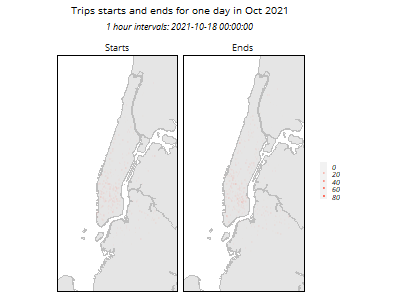

```{r setup, include=FALSE}
knitr::opts_chunk$set(echo = TRUE)
```
Since bike-share ridership exhibits strong space-time dependencies, I visualize both in Figure 3.5 through an animation of trip starts and ends on the Monday of week 42 with 1-hour intervals.
<div align="center">
```{r animation2, echo=FALSE, fig.cap="Figure 3.6"}

```
</div>
Since bike-share ridership exhibits strong space-time dependencies, I visualize both in Figure 3.5 through an animation of trip starts and ends on the Monday of week 42 with 1-hour intervals.